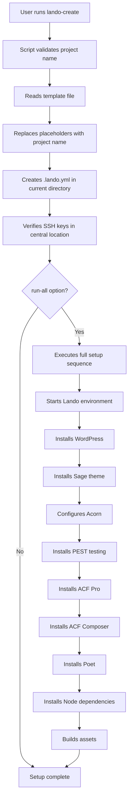

# 🚀 Lando Generator

A powerful bash script and shell function to automate the creation of `.lando.yml` files for WordPress development with Sage theme, Acorn, PEST testing, ACF Composer, and Poet. Works on both Linux and macOS.

## 📋 Table of Contents

- [✨ Features](#-features)
- [🛠️ How It Works](#️-how-it-works)
- [⚙️ Installation](#️-installation)
- [🚀 Usage](#-usage)
- [📁 Project Structure](#-project-structure)
- [🔧 Configuration](#-configuration)
- [📝 Examples](#-examples)
- [🤝 Contributing](#-contributing)
- [📄 License](#-license)

## ✨ Features

- 🎯 **Automated Lando Setup**: Generate `.lando.yml` files with proper configuration
- 🌐 **WordPress + Sage**: Complete WordPress installation with Sage theme
- 🔧 **Acorn Integration**: Laravel components for WordPress
- 🧪 **PEST Testing**: PHP testing framework setup
- 📝 **ACF Composer**: Advanced Custom Fields builder
- 📚 **Poet**: Additional library integration
- 🔑 **SSH Key Management**: Uses central SSH keys directly (no duplication)
- 🚀 **One-Command Setup**: Full environment setup with `run-all` option
- 📍 **Remote Usage**: Use from any directory via shell function (bash/zsh)
- 🌍 **Cross-Platform**: Works on Linux and macOS with dynamic path detection

## 🛠️ How It Works

### Core Components

1. **`lando-create.sh`** - Main bash script that generates `.lando.yml` files
2. **`.lando.example.yml`** - Template file with all configurations
3. **`setup/`** - Directory containing SSH keys for private repository access
4. **Shell Function** - Allows usage from any directory (bash/zsh)

### Script Flow



### Key Features

- **Template System**: Uses `.lando.example.yml` as a template with placeholders
- **Path Resolution**: Automatically finds script location and works from any directory
- **SSH Key Management**: Uses SSH keys directly from central location (no duplication)
- **Error Handling**: Comprehensive error checking and user feedback
- **Colored Output**: Beautiful terminal output with emojis and colors

## ⚙️ Installation

### Prerequisites

- **Operating System**: Linux or macOS
  - Linux: Tested on Arch Linux
  - macOS: Tested on macOS 14.6.0
- [Lando](https://lando.dev/) installed
- [Docker](https://www.docker.com/) running
- Bash or Zsh shell
- SSH keys for private repository access

### Setup Steps

1. **Clone or Download** this repository to your desired location:
   ```bash
   git clone git@github.com:lajennylove/lando-generator.git
   cd lando-generator
   ```

2. **Add SSH Keys** to the `setup/` directory:
   ```bash
   # Copy your SSH keys to the setup directory
   cp ~/.ssh/id_ed25519 setup/
   cp ~/.ssh/id_ed25519.pub setup/
   ```

3. **Add Shell Function** to your shell configuration file:

   **For Bash (Linux/macOS)** - Add to `~/.bashrc`:
   ```bash
   # Lando Generator Function
   # Add this function to use lando-create from any directory
   lando-create() {
       # Try to find the script in common locations
       local script_path=""
       local possible_paths=(
           "/home/$USER/code/lando-generator/lando-create.sh"
           "$HOME/code/lando-generator/lando-create.sh"
           "$HOME/lando-generator/lando-create.sh"
           "./lando-create.sh"
           "lando-create.sh"
       )
       
       # Check each possible path
       for path in "${possible_paths[@]}"; do
           if [ -f "$path" ]; then
               script_path="$path"
               break
           fi
       done
       
       # If not found, try to find it in the current directory or PATH
       if [ -z "$script_path" ]; then
           script_path=$(which lando-create.sh 2>/dev/null || echo "")
       fi
       
       if [ -z "$script_path" ] || [ ! -f "$script_path" ]; then
           echo "❌ Error: lando-create.sh not found"
           echo "Please ensure the lando-generator project is installed and accessible"
           echo "Tried paths: ${possible_paths[*]}"
           return 1
       fi
       
       # Call the script from the found location
       bash "$script_path" "$@"
   }
   ```

   **For Zsh (macOS)** - Add to `~/.zshrc`:
   ```bash
   # Lando Generator Function
   # Add this function to use lando-create from any directory
   lando-create() {
       # Try to find the script in common locations
       local script_path=""
       local possible_paths=(
           "/Users/$USER/code/lando-generator/lando-create.sh"
           "$HOME/code/lando-generator/lando-create.sh"
           "$HOME/lando-generator/lando-create.sh"
           "./lando-create.sh"
           "lando-create.sh"
       )
       
       # Check each possible path
       for path in "${possible_paths[@]}"; do
           if [ -f "$path" ]; then
               script_path="$path"
               break
           fi
       done
       
       # If not found, try to find it in the current directory or PATH
       if [ -z "$script_path" ]; then
           script_path=$(which lando-create.sh 2>/dev/null || echo "")
       fi
       
       if [ -z "$script_path" ] || [ ! -f "$script_path" ]; then
           echo "❌ Error: lando-create.sh not found"
           echo "Please ensure the lando-generator project is installed and accessible"
           echo "Tried paths: ${possible_paths[*]}"
           return 1
       fi
       
       # Call the script from the found location
       bash "$script_path" "$@"
   }
   ```

4. **Reload your shell**:
   ```bash
   # For Bash
   source ~/.bashrc
   
   # For Zsh
   source ~/.zshrc
   ```

## 🚀 Usage

### Basic Usage

```bash
# Navigate to your project directory
cd /path/to/your/project

# Create just the .lando.yml file
lando-create my-project

# Run full setup (WordPress + Sage + Acorn + PEST + ACF + Poet)
lando-create my-project run-all
```

### What Gets Created

When you run `lando-create my-project`, the following files are created in your current directory:

```
your-project/
└── .lando.yml          # Lando configuration file
```

When you run `lando-create my-project run-all`, additionally:

```
your-project/
├── .lando.yml          # Lando configuration file
└── web/                # WordPress installation
    ├── wp-admin/       # WordPress admin
    ├── wp-content/     # WordPress content
    │   └── themes/
    │       └── my-project/  # Sage theme
    ├── wp-includes/    # WordPress core
    └── index.php       # WordPress entry point
```

**Note**: SSH keys are used directly from the central location and are not copied to individual projects, avoiding duplication and security issues. The script automatically detects the correct path regardless of where you install the lando-generator project.

## 📁 Project Structure

```
lando-generator/
├── README.md                    # This file
├── lando-create.sh             # Main bash script
├── .lando.example.yml          # Template file
├── lando-create-function.sh    # Shell function (reference)
└── setup/                      # SSH keys directory
    ├── id_ed25519             # Private SSH key
    └── id_ed25519.pub         # Public SSH key
```

## 🔧 Configuration

### Template Customization

Edit `.lando.example.yml` to customize the default configuration:

- **Project Name**: Replace `workouts` with your default project name
- **PHP Version**: Change `php: '8.3'` to your preferred version
- **Database**: Modify `database: mariadb:10.6` as needed
- **Tooling Commands**: Add or modify tooling commands in the `tooling:` section

### SSH Key Setup

The script uses SSH keys directly from the central `setup/` directory (no copying). Make sure your SSH keys are properly configured:

1. **Generate SSH keys** (if you don't have them):
   ```bash
   ssh-keygen -t ed25519 -C "your-email@example.com"
   ```

2. **Add public key to GitHub**:
   ```bash
   cat setup/id_ed25519.pub
   # Copy the output and add it to your GitHub account
   ```

3. **Test SSH connection**:
   ```bash
   ssh -T git@github.com
   ```

## 📝 Examples

### Example 1: Basic Project Setup

```bash
# Create a new project directory
mkdir ~/code/my-blog
cd ~/code/my-blog

# Generate .lando.yml file
lando-create my-blog

# Start Lando
lando start

# Install WordPress manually
lando wpinstall
```

### Example 2: Full Automated Setup

```bash
# Create a new project directory
mkdir ~/code/ecommerce-site
cd ~/code/ecommerce-site

# Run full setup
lando-create ecommerce-site run-all

# Your site is now ready at:
# https://ecommerce-site.lndo.site/
```

### Example 3: Custom Configuration

```bash
# After creating the project, customize the .lando.yml file
lando-create my-project

# Edit .lando.yml to add custom services or configurations
vim .lando.yml

# Start with custom configuration
lando start
```

## 🛠️ Available Tooling Commands

After setup, you can use these Lando commands:

```bash
# WordPress
lando wpinstall          # Install WordPress
lando wp <command>        # Run WP-CLI commands

# Sage Theme
lando sageinstall        # Install Sage theme
lando inst               # Install Node dependencies
lando build              # Build assets
lando dev                # Development build with watch

# Acorn
lando acorninstall       # Install and configure Acorn
lando purge              # Purge Acorn caches
lando purge-full         # Full cache purge

# Testing
lando pestinstall        # Install PEST testing framework
lando test               # Run tests
lando test-parallel      # Run tests in parallel

# ACF & Extensions
lando inst-acf           # Install ACF Pro
lando inst-acf-composer  # Install ACF Composer
lando inst-poet          # Install Poet

# Utilities
lando composer <command> # Run Composer commands
```

## 🔍 Troubleshooting

### Common Issues

1. **SSH Key Permission Denied**:
   ```bash
   # Check SSH key permissions
   chmod 600 setup/id_ed25519
   chmod 644 setup/id_ed25519.pub
   ```

2. **Lando Port Conflicts**:
   ```bash
   # Stop other Lando projects
   lando poweroff
   
   # Or destroy specific project
   lando destroy -y
   ```

3. **WordPress Installation Issues**:
   ```bash
   # Clean up and retry
   rm -rf web/
   lando destroy -y
   lando-create my-project run-all
   ```

4. **Function Not Found**:
   ```bash
   # Reload your shell
   source ~/.bashrc    # For Bash
   source ~/.zshrc     # For Zsh
   
   # Or restart your terminal
   ```

### Debug Mode

Enable debug mode by setting the script path manually:

```bash
# Test the script directly (replace with your actual path)
bash /path/to/your/lando-generator/lando-create.sh my-project

# Or test the function
lando-create my-project
```

## 🤝 Contributing

1. Fork the repository
2. Create a feature branch: `git checkout -b feature/amazing-feature`
3. Commit your changes: `git commit -m 'feat: add amazing feature'`
4. Push to the branch: `git push origin feature/amazing-feature`
5. Open a Pull Request

### Development Setup

```bash
# Clone the repository
git clone git@github.com:lajennylove/lando-generator.git
cd lando-generator

# Make your changes
# Test your changes
bash lando-create.sh test-project

# Commit and push
git add .
git commit -m "feat: your changes"
git push origin main
```

## 📄 License

This project is licensed under the MIT License - see the [LICENSE](LICENSE) file for details.

## 🙏 Acknowledgments

- [Lando](https://lando.dev/) - Local development environment
- [Sage](https://roots.io/sage/) - WordPress starter theme
- [Acorn](https://roots.io/acorn/) - Laravel components for WordPress
- [PEST](https://pestphp.com/) - PHP testing framework
- [ACF Composer](https://github.com/Log1x/acf-composer) - ACF Builder for Sage
- [Poet](https://github.com/Log1x/poet) - Additional WordPress library

---

Made with ❤️ by [lajennylove](https://github.com/lajennylove)
